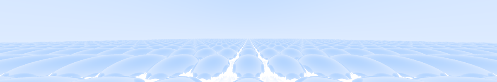
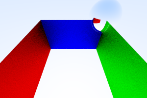
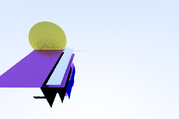

# Ray tracing

The following exercises are intended to familiarise you with [ray
tracing](https://en.wikipedia.org/wiki/Ray_tracing_(graphics)), which will be
the computational problem you work within at the HPPS exam. A *ray tracer* is a
program that generates an image based on a description of a 3D scene and a
camera position within the scene. It does this by shooting rays from the camera,
corresponding to the pixel coordinates of the output image, checking which
objects these rays collide with, and using this information to colour the pixels
of an output image. Usually we sample the image many times, with the rays
randomly pertubed, in order to get good image. This is because the interaction
between a ray of light and an object is randomised (to simulate natural
fluctuations and matte surfaces), so we need to sample many times to get a
proper distribution.

Ray tracers are interesting because they can produce photorealistic images by
simulating the behaviour of light at a high fidelity. The downside is that ray
tracing is very computationally expensive, and usually intractable for real time
graphics.

The ray tracer you work on in HPPS is not particularly sophisticated, as our
focus is on systems-level issues, rather than on computer graphics. In fact, you
are not required to understand the underlying mathematics behind ray tracing,
nor will it be useful for the exam.

The design of the ray tracer is based on the tutorial series [Ray Tracing in One
Weekend](https://raytracing.github.io/) by Peter Shirley, Trevor D Black, and
Steve Hollasch. If you are interested in computer graphics, then I strongly
recommend reading these tutorials (but wait until after the exam).

## Vectors

Unsurprisingly, ray tracing involves a significant amount of geometry. The files
[geometry.h](handout/geometry.h)/[geometry.c](handout/geometry.c) in the code
handout contain a small library for operations on vectors and related
structures. You should briefly familiarise yourself with these functions,
although there is nothing too surprising here.

Apart from using the `vec` type to represent points in 3D space, we will also
use them to represent colours, with the *x*, *y* and *z* components representing
the red, green, and blue colour channels respectively, with values from 0 to 1.

## Materials

A scene consists of a variety of *objects* in a 3D space. Each object is made of
a *material*, which defines how light behaves when it hits the object. We will
start by defining a data type for materials. Start by creating two files:

* `scene.h`, which will contain our type definitions and function prototypes.
  You should include `geometry.h` from this file.

* `scene.c`, which will implement the functions declared in `scene.h`.

As you implement functions in `scene.c`, you should also write test programs (in
different files) that make use of them.

We will support three materials. Add the following type definitions to
`scene.h`:

```C
struct lambertian {
  struct vec albedo;
};

struct metal {
  struct vec albedo;
  double fuzz;
};

struct dielectric {
  double ref_idx;
};
```

* A `lambertian` material is matte, with the `albedo` field describing the
  colour of the material.

* A `metal` material has a colour given by `albedo`, and reflectivity given by
  `fuzz` (0-1).

* A `dielectric` material has no inherent colour and is highly reflective, given
  by `ref_idx` (0-2).

We wish to have a general type that represents *any* of the three types of
material. In a functional programming language such as F#, Haskell, or Futhark,
we would do this with a sum type. In C, we use a union. Add the following
definitions to `scene.h`:

```C
enum MATERIAL_TYPE { LAMBERTIAN, METAL, DIELECTRIC };

struct material {
  enum MATERIAL_TYPE type;
  union {
    struct lambertian lambertian;
    struct dielectric dielectric;
    struct metal metal;
  };
};
```

An *enum type* in C is essentially an integer, for which we define three
constants: `LAMBERTIAN`, `METAL`, `DIELECTRIC`. Their numeric values will be 0,
1, and 2 respectively, although we will not care about the specific values.

A `union` is similar to a `struct`, except that the fields all share the same
memory. This is potentially dangerous: if we write to the `lambertian` field and
later write to the `metal` field, then we overwrite the memory that stores
`lambertian`, possibly with nonsense. We use the `type` field to distinguish
which of the three union fields actually contain meaningful data.

We can create instances of `material` with code like this:

```C
struct material m;
m.type = METAL;
m.metal.albedo.x = 1.0;
m.metal.albedo.y = 0.5;
m.metal.albedo.z = 0.3;
m.metal.fuzz = 0.8;
```

You should now write a test program that creates a variable of type `struct
material`. Make sure you can compile and run it, but it does not yet have to do
anything interesting.

[See here for the solution.](solution/simple_test.c)

### Describing materials

Add the following function prototype to `scene.h`:

```C
void describe_material(struct material*);
```

The `describe_material()` function should print a human-readable description of
the material. The precise format does not matter. For example, our solution
prints things like:

```
lambertian(albedo=(0.800000,0.100000,0.200000))
```

Implement `describe_material()` in `scene.c`. The trick is that you need to
check the `type` field of the material, and treat each of the three cases
differently.

<details>
<summary>Open this to see the solution</summary>

```C
void describe_material(struct material* material) {
    switch (material->type) {
    case LAMBERTIAN:
      printf("lambertian(albedo=(%f,%f,%f))\n",
              material->lambertian.albedo.x,
              material->lambertian.albedo.y,
              material->lambertian.albedo.z);
      break;
    case METAL:
      printf("metal(albedo=(%f,%f,%f), fuzz=%f)\n",
              material->metal.albedo.x,
              material->metal.albedo.y,
              material->metal.albedo.z,
              material->metal.fuzz);
      break;
    case DIELECTRIC:
      printf("dielectric(ref_idx=%f)\n",
             material->dielectric.ref_idx);
      break;
    default:
      abort();
    }
}
```

</details>

## Objects

Similarly to how we have different materials, we also have different objects,
each of which consists of a material. For simplicity, we have four kinds of
objects:

* Spheres, with a centre and a radius.

* Three kinds of rectangles, aligned with either the x/y dimensions, x/z
  dimensions, or y/z dimensions.

Add the following definitions to `scene.h`:

```C
enum OBJECT_TYPE { SPHERE, XY_RECTANGLE, XZ_RECTANGLE, YZ_RECTANGLE };

struct sphere {
  struct vec centre;
  double radius;
  struct material* material;
};

struct xy_rectangle {
  double x0, x1, y0, y1, k;
  struct material* material;
};

struct xz_rectangle {
  double x0, x1, z0, z1, k;
  struct material* material;
};


struct yz_rectangle {
  double y0, y1, z0, z1, k;
  struct material* material;
};

struct object {
  enum OBJECT_TYPE type;

  union {
    struct sphere sphere;
    struct xy_rectangle xy_rectangle;
    struct xz_rectangle xz_rectangle;
    struct yz_rectangle yz_rectangle;
  };
};
```

Note how the `struct object` type uses an a union to distinguish the different
types of objects, just as with `struct material`.

For an `xy_rectangle`, it spans the *x* dimension from `x0` to `x1`, the *y*
dimension from `y0` to `y1`, and is located at `k` in the `z` dimension. The
other rectangle variants are analogous.

As before, write a small test program that creates one or more materials and one
or more objects.

Also add the following prototype to `scene.h`:

```C
struct material *object_material(struct object *o);
```

Add an implementation of `object_material()` to `scene.c`. It should return the
material of an object.

<details>
<summary>Open this to see the solution</summary>

```C
struct material *object_material(struct object *o) {
  switch (o->type) {
  case SPHERE:
    return o->sphere.material;
  case XY_RECTANGLE:
    return o->xy_rectangle.material;
  case XZ_RECTANGLE:
    return o->xz_rectangle.material;
  case YZ_RECTANGLE:
    return o->yz_rectangle.material;
  default:
    abort();
  }
}
```

</details>

### Describing objects

Add the following prototype to `scene.h`:

```C
void describe_object(struct object*);
```

As with `describe_material()`, this function must print a human-readable
description of the object, in no particular format. For inspiration:

```
yz_rectangle
  y0=-5.000000
  y1=0.000000
  z0=-5.000000
  z1=5.000000
  k=-4.000000
  material=metal(albedo=(1.000000,0.000000,0.000000), fuzz=0.900000)
yz_rectangle
  y0=-5.000000
  y1=0.000000
  z0=-5.000000
  z1=5.000000
  k=4.000000
  material=metal(albedo=(0.000000,1.000000,0.000000), fuzz=0.900000)
sphere
  centre=(4.000000,0.000000,-6.000000)
  material=lambertian(albedo=(0.800000,0.800000,0.800000))
xy_rectangle
  x0=-4.000000
  x1=4.000000
  y0=-5.000000
  y1=0.000000
  k=-5.000000
  material=metal(albedo=(0.000000,0.000000,1.000000), fuzz=0.900000)
```

<details>
<summary>Open this to see the solution</summary>

```C
void describe_object(struct object* object) {
    switch (object->type) {
    case SPHERE:
      printf("sphere\n  centre=(%f,%f,%f)\n  material=",
              object->sphere.centre.x,
              object->sphere.centre.y,
              object->sphere.centre.z);
      describe_material(object->sphere.material);
      break;
    case XY_RECTANGLE:
      printf("xy_rectangle\n  x0=%f\n  x1=%f\n  y0=%f\n  y1=%f\n  k=%f\n  material=",
              object->xy_rectangle.x0,
              object->xy_rectangle.x1,
              object->xy_rectangle.y0,
              object->xy_rectangle.y1,
              object->xy_rectangle.k);
      describe_material(object->xy_rectangle.material);
      break;
    case XZ_RECTANGLE:
      printf("xz_rectangle\n  x0=%f\n  x1=%f\n  z0=%f\n  z1=%f\n  k=%f\n  material=",
              object->xz_rectangle.x0,
              object->xz_rectangle.x1,
              object->xz_rectangle.z0,
              object->xz_rectangle.z1,
              object->xz_rectangle.k);
      describe_material(object->xz_rectangle.material);
      break;
    case YZ_RECTANGLE:
      printf("yz_rectangle\n  y0=%f\n  y1=%f\n  z0=%f\n  z1=%f\n  k=%f\n  material=",
              object->yz_rectangle.y0,
              object->yz_rectangle.y1,
              object->yz_rectangle.z0,
              object->yz_rectangle.z1,
              object->yz_rectangle.k);
      describe_material(object->yz_rectangle.material);
      break;
    default:
      abort();
    }
}
```

</details>

You should also write a test program that creates a bunch of objects and
materials and uses this function. [Like this
one.](solution/test_describe_object.c).

## Pseudo-random numbers

A ray tracer makes use of random numbers to simulate the unpredictable nature of
light scattering of matte or metallic surfaces. Therefore we will also make use
of a small library for generating random numbers. You are not required to
understand the mathematics behind random number generation (it is a very deep
field), but you should understand the programming interface. The library is
found in [random.h](handout/random.h)/[random.c](handout/random.c)

Computers are deterministic machines and cannot generate random numbers, unless
they have access to some external sensor. Thus, we actually generate
*pseudo*-random numbers through arithmetic using some *random number generator
state* (RNG). In our library, the state is represented with the type `struct
rng`. An RNG can be asked to produce a random number, during which it will also
modify its internal state such that a (potentially) new number will be generated
next.

A fresh RNG must be initialised by passing in some *seed value*. If two RNGs are
initialised with the same seed, then they will produce the same sequence of
random numbers. This can be a problem, but it can also be useful, as it means we
can reproduce the same "random" sequences multiple times, for reproducibility.

In our library, we initialise the RNG state as follows:

```C
struct rng rng;
seed_rng(&rng, 42);
```

The seed value can be any integer we wish. The important thing is that if we
have multiple RNGs in use, they ought to have been initialised with different
seeds.

Once we have an RNG, we can generate random values using various functions. For
example, the following function generates and returns a random non-negative
integer with unspecified upper bound:

```C
int random_int(struct rng *rng);
```

And the following function generates a random `double` in the range `(0,1)`:

```C
double random_double(struct rng *rng);
```

Write a test program that uses the random number library to roll 10 six-sided
dice and reports each roll.

[See solution here](solution.roll_dice.c)

## The rest of the owl

It is now time to add the actual ray tracing logic. The details are not
important for these exercises (or for the exam), and hence you should now use
[scene.h](solution/scene.h)/[scene.c](solution/scene.c) from the exercise
solutions.

The two most important functions are the following:

```C
// Find the intersection (if any) between the given object and a ray. The t0/t1
// arguments determine a minimum and maximum distance respectively - collisions
// outside this range are ignored. Store the result of the hit in the 'hit'
// argument. Returns true if a hit is determined.
bool object_hit(struct object *o, struct ray *r,
                double t0, double t1, struct hit *hit);


// Get a ray emitted from a camera.
struct ray get_ray(struct rng *rng, struct camera* c, double s, double t);
```

Using these, we can sketch out the ray tracing algorithm:

1. Generate rays corresponding to the pixel positions in space of the image we
   wish to generate.

2. For each ray, find the closest intersecting object in the space by iterating
   through all objects. This is quite similar to the brute-force solution of
   *k*-NN.

3. If we found a collision, compute the scattering/bounce of the ray (if any)
   and repeat until we reach our *depth limit*, which restricts how many times
   we allow light to bounce. For these exercises, the depth limit is rather
   arbitrarily 5. Each bounce off a material contributes to the final colour,
   based on the material.

4. If a ray escapes (does not intersect any object), compute a "horizon colour"
   by whatever formula is appropriate. In real ray tracers, we would have
   explicit light-emitting objects, but for simplicity we assume a kind of
   ambient lighting.

5. Repeat all of this some number of times, taking the average colour of rays
   fired for each pixel.

In [ray.c](solution/ray.c), this is done by the functions `find_hit`, `colour`,
and `render`. You do not have to implement this yourself. However, read the code
(particularly `render`) and use it to answer the following questions. These are
not trick questions; it is just motivation to read the code, as it is very
likely you will be asked to make modifications during the exam. Again, *you do
not need to understand the purpose of the code* - focus on the control flow and
the data being accessed and modified.

1. What is the asymptotic complexity of `find_hit()`?

2. What is the asymptotic complexity of `colour()`?

3. What is the asymptotic complexity of `render()`?

<details>
<summary>Open this to see the solution</summary>

1. `find_hit()` needs to iterate through all objects. For each object, it calls
   `object_hit()`. By rough inspection, we see that `object_hit()` must have
   `O(1)` complexity (no loops). Therefore, the complexity of `find_hit()` is
   `O(num_objects)`.

2. In the worst case, `colour()` calls itself `max_depth` times. Each time it
   calls `find_hit()`, `scattering()`, and some vector operations. By inspection
   we see that `scattering()` has no loops (and neither do the vector
   operations), hence they are constant time. Above we found that `find_hit()`
   has complexity `O(num_objects)`. Hence the overall worst-case complexity of
   `colour()` is `O(max_depth*num_objects)`.

3. `render()` is essentially a three-deep nested loop with a total number of
   `ns*nx*ny` iterations. The only non-constant-time computation that occurs is
   the call to `colour()`, which we determined above to have complexity
   *O(max_depth*num_objects)*. Hence the total complexity of `render()` (and ray
   tracing overall) is `O(ns*nx*ny*max_depth*num_objects)`.

</details>

### Running the ray tracer

If reading the code is not sufficient for you, you can now also run the ray
tracer. Start by compiling it (using the [Makefile](solution/Makefile) from the
solution):

```
$ make ray
```

Then we can run it as follows:

```
$ ./ray out.ppm 300 200 10
```

This will produce a 300x200 image with 10 rays per pixel, in the PPM image
format. It should look like this:



The PPM format is very easy to generate, but not all image viewers support it.
You can convert PPM files to a more standard format with
[ImageMagick](https://imagemagick.org/) as follows:

```
$ magick out.ppm out.png
```

...or you can use an image viewer with PPM support. I use
[feh](https://feh.finalrewind.org/).

By default, the ray tracer generates a scene that I have titled "nice" (because
it looks nice). To generate a different scene, pass a scene name as the fourth
argument, e.g:

```
$ ./ray random.ppm 300 200 10 random
```

This will generate a random scene. The likelihood of these scenes looking nice
is rather low.



The available scenes are `empty`, `nice`, `random`, `irreg`, and `rgbbox`.
